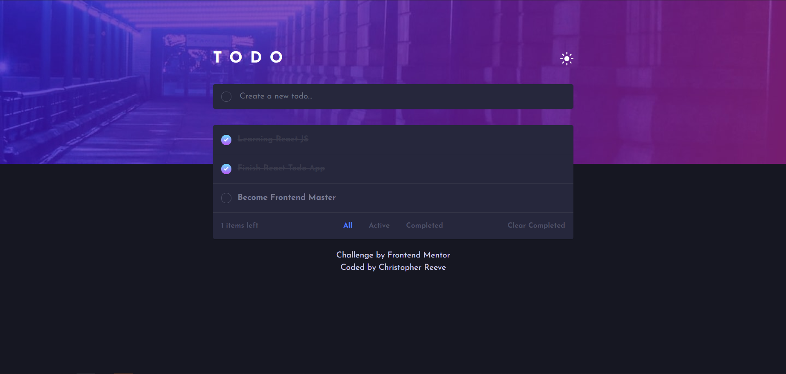

# Frontend Mentor - Todo app solution

This is a solution to the [Todo app challenge on Frontend Mentor](https://www.frontendmentor.io/challenges/todo-app-Su1_KokOW). Frontend Mentor challenges help you improve your coding skills by building realistic projects. 

## Table of contents

1. [Frontend Mentor - Todo app solution](#frontend-mentor---todo-app-solution)
	1. [Table of contents](#table-of-contents)
		1. [The challenge](#the-challenge)
		2. [Screenshot](#screenshot)
		3. [Links](#links)
		4. [Built with](#built-with)
		5. [What I learned](#what-i-learned)
		6. [Continued development](#continued-development)
	2. [Author](#author)

### The challenge

Users should be able to:

- View the optimal layout for the app depending on their device's screen size
- See hover states for all interactive elements on the page
- Add new todos to the list
- Mark todos as complete
- Delete todos from the list
- Filter by all/active/complete todos
- Clear all completed todos
- Toggle light and dark mode
- **Bonus**: Drag and drop to reorder items on the list

### Screenshot

### Links

- Solution URL: [Frontend mentor](https://www.frontendmentor.io/solutions/todo-apps-with-reactjs-and-tailwindcss-sVYbADza6)
- Live Site URL: [Live site](https://zynth17.github.io/todo-app-frontend-mentor/)

### Built with

- Semantic HTML5 markup
- CSS custom properties
- Flexbox
- Mobile-first workflow
- [React](https://reactjs.org/) - JS library
- [Tailwindcss](https://tailwindcss.com/) - Css utility library

### What I learned
this is my first time building a website with dark mode and its quite kinda tiring even with tailwind but the result is satifying for me!

### Continued development

this project is still under development since i haven't implemented the sort function yet and will do it soon

## Author

- Website - [creeve.me](https://creeve.me)
- Frontend Mentor - [@zynth17](https://www.frontendmentor.io/profile/zynth17)
- Twitter - [@hi_reeve](https://twitter.com/hi_reeve)
- Instagram - [@hi_reeve](https://www.instagram.com/hi_reeve/)
- Github - [zynth17](https://github.com/zynth17)